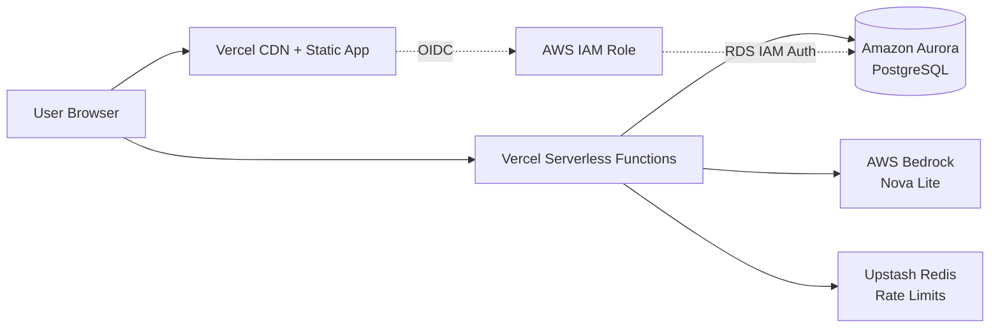

# LettuceEat — Demo Script

Use this for your **< 3 minute hackathon video** and as a **live walkthrough** script. Total spoken time target: **2:40–2:55** (leave a few seconds of buffer).

---

## Quick reference

| Item | Value |
|------|-------|
| **App name** | LettuceEat |
| **Track** | Track 1 — Monetizable B2C (grocery / meal planning) |
| **Problem** | Turning online recipes into a priced, store-ready shopping list |
| **Audience** | Home cooks who want to save time and money at the grocery store |
| **AWS Database** | **Amazon Aurora PostgreSQL** |
| **Frontend host** | **Vercel** (React + Vite) |
| **AI layer** | AWS Bedrock (recipe extraction from URLs + screenshots) |
| **Live URL** | _[paste your Vercel deployment URL]_ |
| **Vercel Team ID** | _[paste from Vercel → Settings → General]_ |

---

## Pre-demo checklist (do this 30 minutes before recording)

### Environment

- [ ] Deploy is live on Vercel (not localhost)
- [ ] `/api/health` returns OK
- [ ] `/api/parse-url` works (test with sample URL below)
- [ ] Aurora is reachable from Vercel (OIDC + RDS IAM auth configured)
- [ ] Bedrock credentials are set (`BEDROCK_AWS_*` or `AWS_ROLE_ARN`)
- [ ] Rate limiting (Upstash) is configured so demo traffic doesn’t get blocked

### Browser prep

- [ ] Use **Chrome** in a clean window (no unrelated tabs)
- [ ] Zoom to **100%**, window ~1280px wide (shows desktop layout well)
- [ ] Clear site data for your domain **or** use an Incognito window
- [ ] Disable notifications / Do Not Disturb
- [ ] Close Slack, email, etc.

### Demo data (recommended)

| Setting | Value | Why |
|---------|-------|-----|
| ZIP code | `10001` or your real ZIP | Triggers ranked store list with travel cost |
| Preferred store | Kroger (or top-ranked store) | Consistent pricing in the UI |
| Sample recipe | Click **“Try a sample → Creamy Tuscan White Bean Skillet”** on Add page | Reliable, no typing, fast load |
| Pantry staples | Salt, Olive oil, Garlic already on | Shows pantry savings banner |

### Screens to capture separately (for Devpost submission)

- [ ] **Architecture diagram** (see template at bottom)
- [ ] **AWS proof screenshot**: Aurora cluster in AWS Console *or* Vercel Storage / Postgres integration settings
- [ ] **Vercel project** dashboard showing deployment

### Recording tips

- Record at **1080p**, capture **browser + your face** (optional) or browser-only
- Use **no copyrighted music**
- Speak clearly; judges may stop watching after 3:00
- Do **one uninterrupted take** of the app working, then cut in architecture/AWS B-roll if needed

---

## 3-minute video script (with timestamps)

> **Format:** [SCREEN] = what viewers see · **SAY** = narration

---

### 0:00–0:25 — Hook + problem

**[SCREEN]** LettuceEat home / Add tab. Optional: quick flash of a messy recipe blog with a long ingredient list.

**SAY:**

> “Meet **LettuceEat**. If you cook at home, you’ve felt this: you find a recipe online, then spend twenty minutes copying ingredients, guessing what to buy, and still overbuy because you forgot what’s already in your pantry.
>
> LettuceEat turns any recipe link—or even a screenshot—into a **priced shopping list** for your local store. We built it for **home cooks who want to shop smarter**, not harder.”

---

### 0:25–0:50 — Onboarding + stack (brief)

**[SCREEN]** Settings onboarding: enter ZIP → ranked stores with distance and total cost (grocery + travel).

**SAY:**

> “First, enter your ZIP. LettuceEat ranks nearby stores by **total cost**—groceries plus estimated travel—so you pick the store that actually saves money.
>
> Under the hood, the frontend runs on **Vercel**, and every recipe we save goes to **Amazon Aurora PostgreSQL**—the same class of database startups use in production, not a weekend prototype datastore.”

---

### 0:50–1:35 — Core flow: recipe → list

**[SCREEN]** Add tab → click **“Try a sample → Creamy Tuscan White Bean Skillet”** (or paste a Budget Bytes URL) → wait for loading steps → land on shopping list.

**SAY:**

> “On the Add tab, paste a recipe URL—or upload a photo from Instagram or TikTok. **AWS Bedrock** reads the recipe and extracts title, servings, and ingredients.
>
> In seconds, LettuceEat matches each ingredient to products at your store, with aisle, quantity, and line-item pricing.”

**[SCREEN]** Scroll the shopping list: ingredient rows, matched products, prices, allergen chips if visible.

**SAY:**

> “You get a real shopping list—not just text. We flag **allergens**, show confidence on matches, and you can swap alternatives if the default isn’t right.”

---

### 1:35–2:05 — Pantry + cart (differentiator)

**[SCREEN]** Pantry tab → toggle Salt / Olive oil / Garlic **on**. Back to List → show pantry savings banner and lower total.

**SAY:**

> “Tell LettuceEat what you already have. Items in your **pantry** are automatically excluded, and the total updates—so you’re not rebuying salt every week.”

**[SCREEN]** Tap **Send to cart** → open Cart view → optionally add a second recipe.

**SAY:**

> “Add recipes to a **combined cart** for the week. One trip, one list, one estimated total.”

---

### 2:05–2:35 — AWS database + architecture

**[SCREEN]** Cut to architecture diagram **or** AWS Console Aurora cluster **or** Vercel env showing Postgres connection. Optionally: Network tab showing `/api/parse-url` then `/api/recipes`.

**SAY:**

> “When a list is built, we persist the recipe and ingredients to **Aurora PostgreSQL** through **Vercel’s AWS OIDC integration** and **IAM database authentication**—no long-lived passwords in code. Drizzle ORM manages our schema: users, recipes, and ingredients.
>
> Serverless API routes on Vercel handle parsing, matching, and store ranking. Bedrock handles vision and text extraction. Aurora holds durable recipe history you can query via our `/api/recipes` endpoint.”

---

### 2:35–2:55 — Close

**[SCREEN]** Back to LettuceEat Add or List tab. End card: app URL + “Built for H0 Hackathon #H0Hackathon”.

**SAY:**

> “LettuceEat is a **shippable B2C grocery app**: recipe in, priced cart out, backed by **Aurora on AWS** and **Vercel** in production.
>
> Try it at **[your-vercel-url]**. Thanks for watching.”

---

## Live demo walkthrough (5–7 minutes)

Use this if you’re presenting in person or on a call with time for Q&A.

### 1. Set the stage (30 sec)

- Name the problem: recipe → grocery gap
- Name the user: busy home cooks, budget-conscious families
- Name the stack: Vercel + Aurora PostgreSQL + Bedrock

### 2. First-run onboarding (45 sec)

1. Open app (fresh session)
2. Settings → enter ZIP → **Find stores**
3. Point out ranked stores: distance, travel cost, grocery estimate
4. Select store → **Get started**

**Callout:** “Store ranking hits our Vercel API, which estimates travel using ZIP + chain pricing factors.”

### 3. Build a list from URL (90 sec)

1. Go to **Add**
2. Click sample recipe link (fastest) *or* paste:
   `https://www.budgetbytes.com/creamy-tuscan-white-bean-skillet/`
3. Watch loading: “Reading recipe → Matching prices → Almost done”
4. Walk through list UI:
   - Recipe title, servings, time
   - Matched products + prices
   - Allergen bar (if shown)
   - Pantry savings banner (if staples exist)

**Callout:** “Bedrock extracts the recipe; our matcher maps ingredients to a store catalog; Aurora persists the recipe asynchronously.”

### 4. Pantry (45 sec)

1. Open **Pantry**
2. Toggle staples on (Salt, Olive oil, Garlic)
3. Return to list → show excluded items and updated total

**Callout:** “Pantry is client-side today for speed; the server-side user model in Aurora is ready for sync.”

### 5. Cart + second recipe (60 sec, optional)

1. **Send to cart** from list
2. Add tab → second recipe (different URL)
3. Show **Cart** with merged items

### 6. Architecture slide (60 sec)

Walk the diagram (below). Hit these judge criteria:

| Criterion | What to emphasize |
|-----------|-------------------|
| **Technical** | Aurora + IAM auth, Drizzle schema, Bedrock extraction, Vercel serverless APIs |
| **Design** | Mobile-first, warm UI, clear list/cart/pantry flows |
| **Impact** | Saves time/money; realistic path to Kroger/Instacart integrations |
| **Originality** | Screenshot-to-cart, pantry-aware totals, store ranking with travel cost |

### 7. Q&A prep

**“Why Aurora PostgreSQL?”**  
Relational model fits recipes + ingredients + users; joins and history queries; production-grade scaling on AWS.

**“Why Vercel?”**  
Fast deploys, serverless API routes, native AWS OIDC for secure DB access without embedding secrets.

**“Is pricing real?”**  
Demo uses a curated store catalog with realistic price factors; architecture supports live pricing APIs next.

**“What’s persisted in Aurora?”**  
`users`, `recipes`, `recipe_ingredients` — see `api/_lib/schema.ts`.

---

## Shot list (B-roll / submission extras)

Record these as separate clips you can splice into the main video:

1. **Add tab** — URL paste + submit + loading animation
2. **Add tab** — Photo upload of a recipe screenshot (shows Bedrock vision)
3. **List** — scroll full ingredient table + sidebar cart total animating (`CountUp`)
4. **Pantry** — toggle staple → instant savings on list
5. **Cart** — two recipes merged
6. **AWS Console** — Aurora cluster “Available”
7. **Vercel** — successful deployment + environment variables (redact secrets)
8. **Architecture diagram** — slow zoom

---

## Architecture diagram (for submission)

Include a diagram like this in your Devpost entry (export from Excalidraw, draw.io, or Mermaid):

**Connection summary for submission text:**

- **Frontend:** React SPA built with Vite, deployed on Vercel
- **API:** Vercel Functions (`/api/parse-url`, `/api/parse-screenshot`, `/api/match-item`, `/api/store-options`, `/api/recipes`)
- **Database:** Amazon Aurora PostgreSQL via `pg` + Drizzle ORM; auth via `@aws-sdk/rds-signer` + Vercel OIDC
- **AI:** Amazon Bedrock (`amazon.nova-lite-v1:0`) for URL and screenshot recipe extraction

---

## Devpost submission copy (starter)

**Text description (edit and paste):**

> **LettuceEat** helps home cooks turn any recipe URL or screenshot into a priced, store-ready shopping list. Users set their ZIP code, pick a nearby store ranked by grocery + travel cost, and get matched products with pantry exclusions, allergen flags, and a combined weekly cart.
>
> **AWS Database:** Amazon Aurora PostgreSQL — recipes and ingredients are persisted via Drizzle ORM; Vercel serverless functions connect using AWS IAM authentication (RDS Signer + OIDC).
>
> **Frontend:** Deployed on Vercel (React + Vite).
>
> **Track:** Monetizable B2C — grocery / meal planning.

**Testing instructions for judges:**

1. Open [Vercel URL]
2. Complete onboarding (any valid US ZIP, e.g. `10001`)
3. On Add, click “Try a sample → Creamy Tuscan White Bean Skillet”
4. Explore List, Pantry (toggle staples), and Cart

---

## Troubleshooting during recording

| Issue | Recovery |
|-------|----------|
| URL parse fails | Click sample link; or switch to Photo tab with a pre-loaded screenshot |
| Rate limited | Wait 60s or use a fresh Incognito session |
| Slow Bedrock | Keep talking over loading steps—they’re designed for this |
| DB save fails silently | App still works; mention persistence in voiceover while showing Aurora console |
| Wrong store/prices | Confirm Settings ZIP + store; refresh page |

---

## One-line pitch (elevator)

**LettuceEat turns any recipe into a priced grocery cart for your local store—powered by AWS Bedrock for extraction and Aurora PostgreSQL for production-grade persistence on Vercel.**
